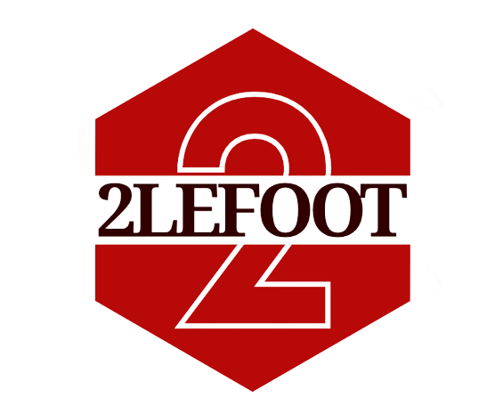
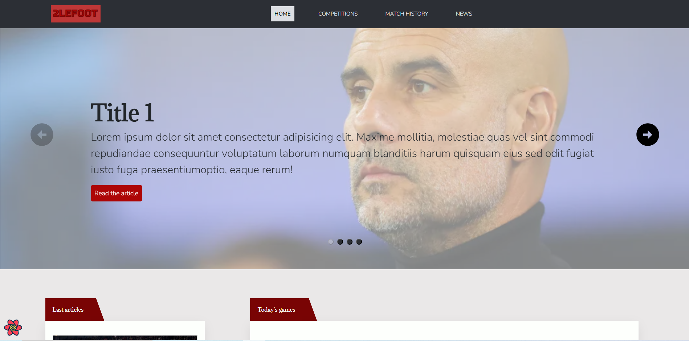

<<<<<<< HEAD
<div align="center">
    <h1>
        
    </h1>
    <h4><b>Soccer website, providing news and matches results</b></h4>
    <h4>
        <a href="#about">About the project</a>
        •
        <a href="#links">Links</a>
        •
        <a href="#built-with">Built with</a>
        •
        <a href="#architecture">Project folder description</a>
        •
        <a href="#development">Development guide</a>
        •
        <a href="#contact">Credits</a>
    </h4>
</div>

<p align="center"> 
    
</p>

## Table of contents

- [Table of contents](#table-of-contents)
- [About the project](#about-the-project)
- [Links](#links)
  - [Figma](#figma)
  - [Trello](#trello)
- [Built with](#built-with)
- [Project folder description (src)](#project-folder-description-src)
- [Development guide](#development-guide)
  - [Prerequisites](#prerequisites)
  - [Installation](#installation)
- [Credits](#credits)

## About the project

<p align="justify"> 
  During my last year of training in computer design and development, we had to present a free project. 
I decided to go for a soccer website, providing news and matches results. Being a soccer fan myself, I wanted to work on a project that animates me and find new visuals. 
</p>


## Links

### Figma

You can see the evolution of the project via Figma. The drafts contain:
  * Mock-ups of the first version (presented at school)
  * Mock-ups of the second version (developed in my spare time after getting my degree)
  * Designs (icons, logos, moodboard...)
  * Presentation support, containing some diagrams (in its first version)

✐ **Visuals**: https://www.figma.com/file/8WgQuNX3rIicR8ZLqHVYod/Soccer?type=design&node-id=0%3A1&t=3eFeRSvXqnsVCsQD-1<br />
✐ **Presentation** : https://www.figma.com/file/GzDt6mZH8dMBC4nituPpfD/2LEFOOT-Presentation?type=design&t=3eFeRSvXqnsVCsQD-1

### Trello

I use Trello or Evernote to organize my work. You will find the list of remaining and completed tasks.

📝 **Trello** (🇫🇷): https://trello.com/b/1adWasWA


## Built with

Frontend
* 
* 
* 

Backend/Database
* 
* 
* 

Hosting
* 
* 


## Project folder description (src)

* Components: reusable components
* Context: context for sections appearing in multiple pages
* Data: json static data
* Images: seeds, icons and other static image contents
* Pages: pages layouts and their components
* Router: routing and redirection components
* Seeds: static data
* Services: queries and mutations
* Styles: custom style vars for CSS and Material UI
* Utils: custom hooks and other reusable functions


## Development guide

### Prerequisites

<p>Make sure you have Node and NPM installed. Open your terminal, and type either of the following commands:</p>

* Installation for Linux (Debian, Ubuntu):
```sh
# Here, we're installing Node.js v18
curl -fsSL https://deb.nodesource.com/setup_18.x | sudo -E bash -
```
```sh
sudo apt-get install -y nodejs
```


* Installation for MacOS
```sh
brew install node
```

* Installation for Windows
Please download Node from the offical website: https://nodejs.org/en/download

<p>Once installed, you can verify Node and NPM versions with the following commands:</p>

```sh
Node --version
```

```sh
npm --version
```

<p>Then, as this app uses a public soccer API, you need a API key to display soccer informations. </p>
<p>Get a free API Key at https://www.football-data.org/client/register</p>


### Installation

1. Clone the repository
   ```sh
   git clone https://github.com/dkm94/soccer-website-mern.git
   ```
2. Install NPM packages
   ```sh
   npm install
   ```
3. Create a `.env` file and create a variable with your api-football.org API key
   ```env
   # You must create a custom environment variable beginning with REACT_APP_
   REACT_APP_FOOTBALL_API_KEY='YOUR_API_KEY';
   ```
4. To run the app in development mode, use the command:
   ```sh
   npm start
   ```


## Credits

<p>Diane M.</p>

[](https://github.com/dkm94)
[](https://www.linkedin.com/in/diane-mpk/)
=======
# soccer-website-ts
>>>>>>> e28a03d86e879dea5aa95f42a13e45a828fbbc6e
